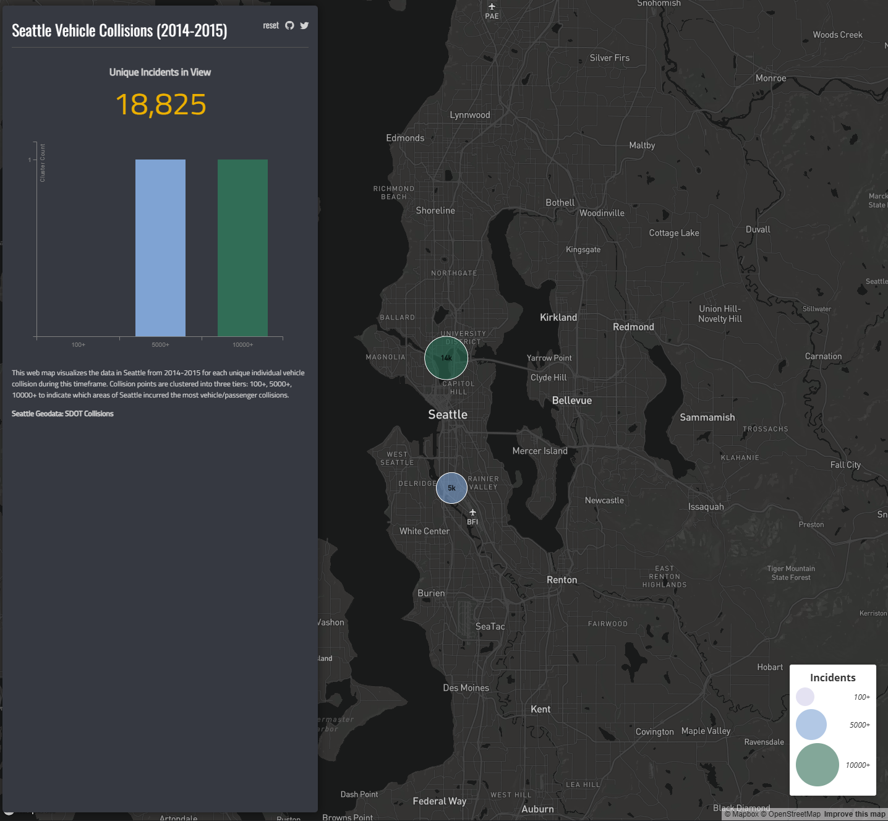

# GEOG458 Seattle Vehicle Collisions Dashboard Web Map

### No AI tools were used in this assignment.

## Web Map URL
Access the web map here: [GEOG458 Lab 6 Web Map](https://kur0vargas.github.io/GEOG458-Lab6/index.html)

## Overview
  
This web map visualizes the data in Seattle from **2014–2015** for each unique individual vehicle collision during this timeframe. Collision points are **clustered into three tiers: 100+, 5000+, 10000+** to indicate which areas of Seattle incurred the most vehicle/passenger collisions.

## Sources / Data
- [Seattle Geodata: SDOT Collisions](https://data-seattlecitygis.opendata.arcgis.com/datasets/SeattleCityGIS::sdot-collisions-vehicles/explore?filters=eyJJTkNEVFRNIjpbMTI2MzYzODA3MTQ1OC4wMywxNDUxMjg0NzY3NTY5Ljk2XSwiU1RfU0VRX0VWTlRTMV9ERVNDIjpbIkNvbGxpc2lvbiBJbnZvbHZpbmcgTW90b3IgVmVoaWNsZSBpbiBUcmFuc3BvcnQiXX0%3D&location=47.599169%2C-122.300229%2C12)
- Credits to Bo Zhao (jakobzhao) for [Lab 6](https://github.com/jakobzhao/geog458/tree/master/weeks/week06) example code
